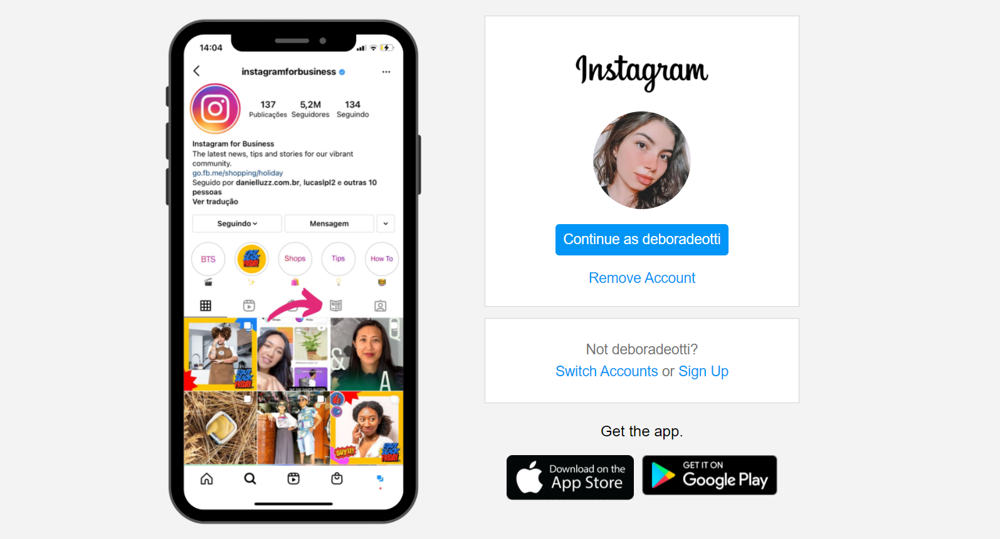
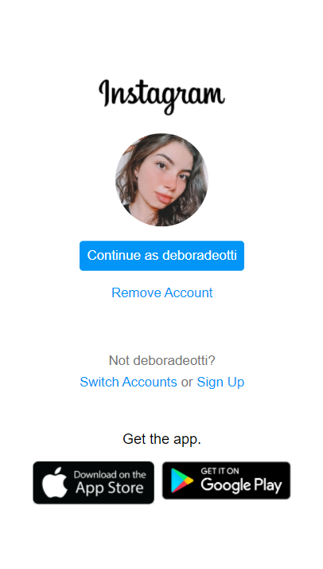

<h2 class="sobre">💻 Sobre o projeto</h2>

Projeto de clone da página de login do Instagram realizado para estudo, utilizando HTML e CSS, explorando flexbox e responsividade.

<h2 class="tecnologias">🛠️ Tecnologias</h2>

- HTML
- CSS

<h2 class="autoria">👩‍💻 Autoria</h2>

    

<b>Débora Deotti</b>

 
